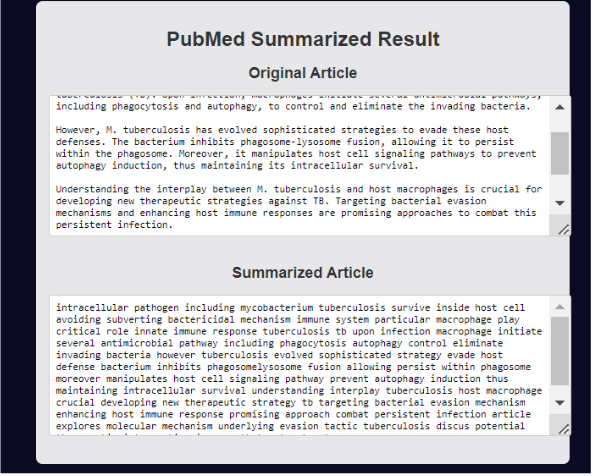

# 🔬 PubMed Article Summarizer Web Application

This project develops a **user-friendly web application** designed for summarizing scientific articles retrieved from PubMed, a central repository for biomedical literature. It aims to provide researchers, students, and anyone interested in scientific content with a quick and efficient way to grasp the key points of long articles.

---

## 🚀 Project Overview

The primary goal of this project was to create an accessible web application that takes PubMed articles as input and generates concise summaries. By leveraging text summarization techniques, the application significantly improves information access, saving users valuable time during literature review and research.

---

## 🎯 Objectives

The core objectives that guided the development of this application were:

* **To create a user-friendly web application:** Providing an intuitive interface accessible via a web browser for wide accessibility and ease of interaction.
* **To integrate PubMed article summarization:** Implementing the functionality to take full PubMed article texts and generate accurate, concise summaries highlighting the main research points.
* **To improve information access:** Enabling users to quickly understand core findings from biomedical literature, thereby streamlining their research process.

---

## 📊 Data Exploration & Preprocessing

This section details the journey of preparing the scientific article data for summarization.

### 2.1 Data Source

The project utilized a **PubMed Summarization Dataset** found on **Hugging Face**, a renowned platform for AI projects and datasets. This dataset, originating from the vast PubMed database, provided a rich and diverse collection of scientific articles with corresponding summaries, essential for training a robust summarization model across various scientific topics.

### 2.2 Data Exploration

Initial data exploration was performed within a Jupyter notebook (`KDD_task.ipynb`) to understand the dataset's characteristics. The key steps included:

1.  **Feature Overview:** Examining the dataset's columns (features) to understand the available information (e.g., full text, summary, metadata).
2.  **Data Size:** Determining the number of samples in the train, test, and validation splits to assess training efficiency and generalizability.
3.  **Examining Examples:** Reviewing the content of the first example from each data split to get a firsthand sense of the article and summary formats.
4.  **Visualization Attempts:** Efforts were made to visualize data patterns, but due to computational constraints, extensive visualizations were not feasible within the project's scope.

This comprehensive exploration laid the foundational understanding for subsequent preprocessing and model development.

### 2.3 Data Preprocessing

Given the nature of Natural Language Processing (NLP) tasks, extensive text preprocessing was crucial. A dedicated Python script (`preprocessing.py`) was developed to clean and normalize the text data for optimal model understanding.

The preprocessing steps included:

1.  **Lowercasing:** Converting all text to lowercase for consistency, treating words uniformly regardless of capitalization.
2.  **Removing Non-Alphabetic Characters and Multiple Spaces:** Utilizing regular expressions (`re` module) to remove punctuation, special characters (`re.sub(r'[^a-z\s]', '', text)`), and consolidate multiple spaces into single spaces (`re.sub(r'\s+', ' ', text).strip()`).
3.  **Tokenization:** Breaking down the cleaned text into individual words (tokens) using `nltk.word_tokenize` for further NLP processing.
4.  **Stopword Removal:** Eliminating common words (e.g., "the," "a") that offer little semantic value for summarization, using NLTK's `stopwords` library.
5.  **Lemmatization:** Reducing words to their base forms (e.g., "running" to "run") using NLTK's `WordNetLemmatizer` to reduce vocabulary size and normalize word forms.

These diligent preprocessing steps ensured the text data was clean, normalized, and ready for effective training and summarization.

---

## 🌐 Web Application Development

The web application was developed using **Flask**, a lightweight and flexible Python web framework, providing a robust foundation for the user interface and core functionalities.

### 3.1 User Interface

The application employs two primary HTML templates to facilitate user interaction:

* `home.html`: The landing page where users can either **upload a PubMed article file** or **paste text directly** into a text area.
* `result.html`: Displays the **user-submitted article text alongside the automatically generated summary**.

Flask's routing capabilities dynamically manage the display between these templates based on user actions.

### 3.2 Summarization Feature

The core summarization logic resides within the `summarize_text` function. This function takes the input text and the desired number of summary sentences.

#### Summarization Process:

1.  **Parsing the Text:** The `sumy` library is used to parse the input text with `PlaintextParser` and `Tokenizer`.
2.  **Summarization Algorithm:** The **`LsaSummarizer`** class, an implementation of **Latent Semantic Analysis (LSA)**, is employed. LSA is an extractive summarization technique that identifies and extracts key sentences based on their semantic relationships within the document.
3.  **Summary Construction:** The function extracts the specified number of sentences (`sentence_count`) from the LSA summarization result.
4.  **Returning the Summary:** A concise summary string is returned for display in the user interface.

#### Integration with Flask Routes:

* The `/` route handles both `GET` and `POST` requests.
* `GET` requests render `home.html`.
* `POST` requests retrieve uploaded files or pasted text.
* The retrieved text is then **preprocessed** using the `preprocess` function from `preprocessing.py`.
* The preprocessed text is fed to `summarize_text` to generate the summary.
* Finally, `result.html` is rendered, displaying both the original article and its generated summary.

---

## ✅ Results and Discussion

The project successfully delivered a functional web application with notable strengths and identified areas for future enhancement.

### Strengths

* **Flexibility and User Choice:** Users can choose to either paste article text or upload a file, accommodating diverse preferences.
* **NLP-powered Summarization:** Effective utilization of NLP techniques provides meaningful summaries of complex scientific articles.
* **User-Friendly Interface:** The Flask-based interface prioritizes ease of use, making the application accessible to a broad audience, including researchers and students of varying technical backgrounds.

### Limitations

* **Limited Visualization:** The current version does not generate visual aids (graphs, charts) to complement summaries, which could enhance understanding for data-driven articles.
* **Deployment Scope:** Currently, the application operates as a standalone web application, limiting its accessibility to a wider public audience.

### Future Improvements

* **Enhanced User Interface Features:** Further refinement of the UI could include pop-up notifications for successful uploads and progress bars during processing.
* **Visual Representation:** Integrating visual elements like charts or graphs to represent trends or relationships within summarized information would significantly improve user comprehension.
* **Deployment and Accessibility:** Deploying the application on a publicly accessible server would maximize its impact by making it available to researchers and students globally.

Addressing these limitations and implementing future improvements will further enhance the application's utility and reach within the scientific community.

---
